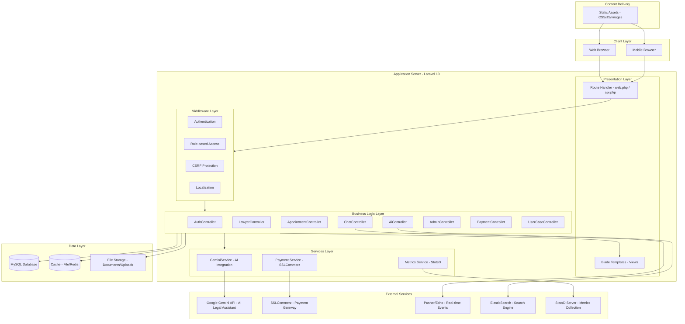
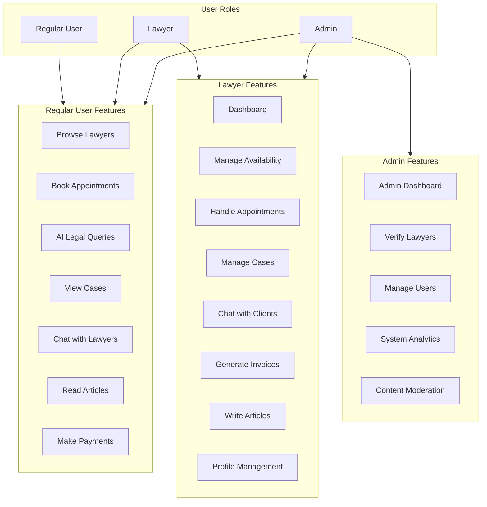
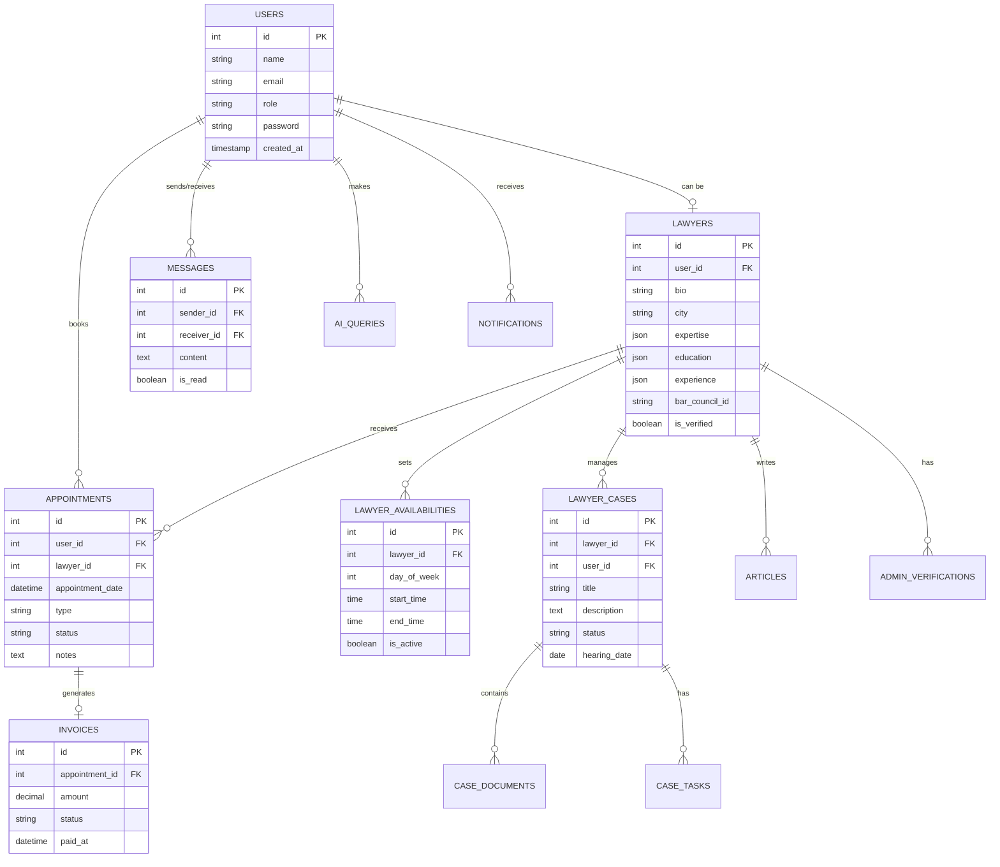
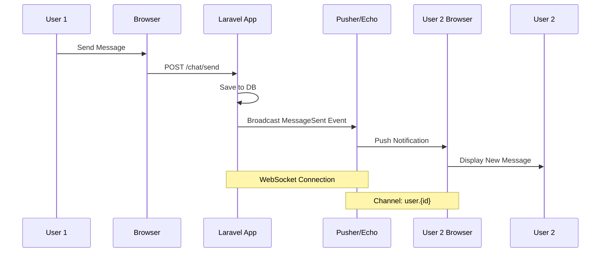
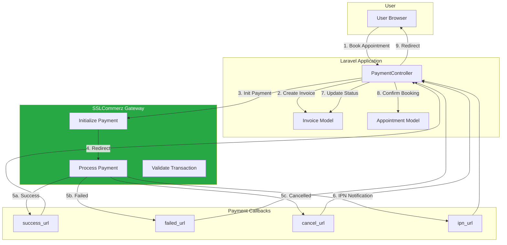
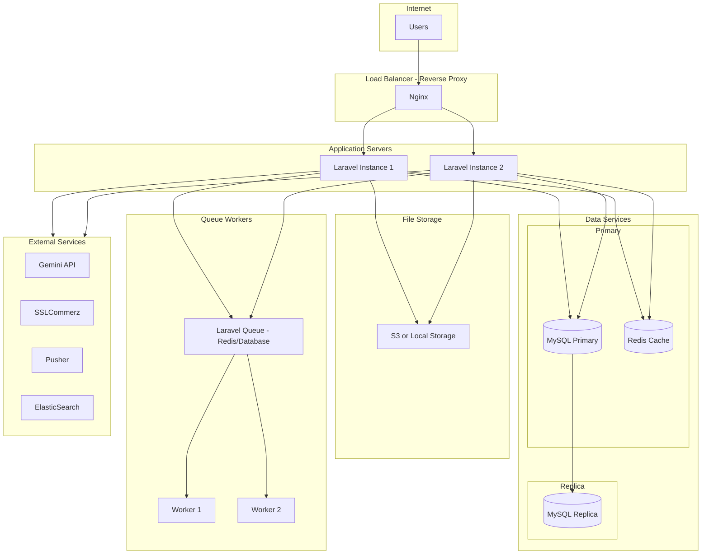

# LawLite - System Architecture Diagram

## Overview

LawLite is a bilingual (Bangla/English) legal consultation and knowledge-sharing platform built with Laravel 10. This document provides comprehensive system architecture diagrams.

---

## 1. High-Level System Architecture

---

## 2. Layered Architecture Diagram

```mermaid
flowchart LR
    subgraph PL[Presentation Layer]
        V1[Blade Views]
        V2[Layouts]
        V3[Components]
        V4[Localization - en / bn]
    end

    subgraph CL[Controller Layer]
        C1[AuthController]
        C2[LawyerController]
        C3[AppointmentController]
        C4[ChatController]
        C5[AiController]
        C6[AdminController]
        C7[PaymentController]
    end

    subgraph SL[Service Layer]
        S1[GeminiService]
        S2[MetricsService]
        S3[PaymentService]
    end

    subgraph ML[Model Layer]
        M1[User]
        M2[Lawyer]
        M3[Appointment]
        M4[LawyerCase]
        M5[Message]
        M6[Invoice]
        M7[Article]
    end

    subgraph DL[Data Layer]
        D1[(MySQL)]
        D2[(Cache)]
        D3[File Storage]
    end

    PL --> CL
    CL --> SL
    CL --> ML
    SL --> ML
    ML --> DL
```

---

## 3. User Role and Access Architecture

---

## 4. AI Integration Architecture

```mermaid
flowchart LR
    subgraph Client[Client Request]
        REQ[User Query - Legal Question]
    end

    subgraph Laravel[Laravel Application]
        subgraph Controllers[Controllers]
            AIC[AiController]
            AFC[AiFeaturesController]
        end
        
        subgraph Service[Service]
            GS[GeminiService]
            MT[Metrics]
        end

        subgraph ErrorHandling[Error Handling]
            GE[GeminiException]
            RH[Retry Handler]
        end
    end

    subgraph GeminiAPI[Google Gemini API]
        EP[generateContent Endpoint]
    end

    subgraph Features[AI Features]
        F1[Legal QA]
        F2[Document Summarization]
        F3[Dhara Lookup - Law Sections]
        F4[Legal Term Definition]
        F5[Document Analysis]
        F6[Case Prediction]
        F7[Procedure Guide]
        F8[Rights Checker]
        F9[Document Drafting]
        F10[Court Fee Calculator]
        F11[Citation Generator]
        F12[Inheritance Calculator]
    end

    REQ --> Controllers
    Controllers --> GS
    GS --> EP
    EP -->|Success| GS
    EP -->|Failure| RH
    RH -->|Retry| EP
    RH -->|Max Retries| GE
    GS --> MT
    Controllers --> Features

    style GeminiAPI fill:#4285F4,color:#fff
    style GE fill:#EA4335,color:#fff
```

---

## 5. Database Entity Relationship Overview

---

## 6. Real-Time Communication Architecture

---

## 7. Payment Flow Architecture

---

## 8. Deployment Architecture

---

## 9. Technology Stack Summary

| Layer | Technology |
|-------|------------|
| **Frontend** | Blade Templates, HTML5, CSS3, JavaScript |
| **Backend Framework** | Laravel 10 (PHP 8.1+) |
| **Database** | MySQL 8.0 |
| **Cache** | File / Redis |
| **Search** | ElasticSearch (Optional) |
| **Real-time** | Pusher / Laravel Echo |
| **AI Integration** | Google Gemini API |
| **Payment Gateway** | SSLCommerz |
| **Metrics** | StatsD (UDP) |
| **Testing** | PHPUnit, PHPStan |
| **CI/CD** | GitHub Actions |

---

## 10. Security Architecture

```mermaid
flowchart TB
    subgraph Security[Security Layers]
        subgraph Network[Network Security]
            HTTPS[HTTPS/TLS]
            CORS[CORS Policy]
            RATE[Rate Limiting]
        end
        
        subgraph App[Application Security]
            CSRF[CSRF Tokens]
            XSS[XSS Protection]
            SQL[SQL Injection Prevention - Eloquent ORM]
            HASH[Password Hashing - bcrypt]
        end
        
        subgraph Auth[Authentication and Authorization]
            SESSION[Session Management]
            ROLES[Role-based Access - user/lawyer/admin]
            MIDDLEWARE[Auth Middleware]
        end
        
        subgraph Data[Data Protection]
            ENCRYPT[AES-256-CBC Encryption]
            VALIDATE[Input Validation]
            SANITIZE[Output Sanitization]
        end
    end

    Network --> App
    App --> Auth
    Auth --> Data
```

---

## Quick Reference: Key Components

| Component | Location | Purpose |
|-----------|----------|---------|
| Routes | `routes/web.php` | Web route definitions |
| Controllers | `app/Http/Controllers/` | Request handling |
| Models | `app/Models/` | Database entities |
| Services | `app/Services/` | Business logic (Gemini, Metrics) |
| Views | `resources/views/` | Blade templates |
| Config | `config/` | App configuration |
| Migrations | `database/migrations/` | Database schema |

---

*Generated for LawLite Legal Platform - January 2026*
